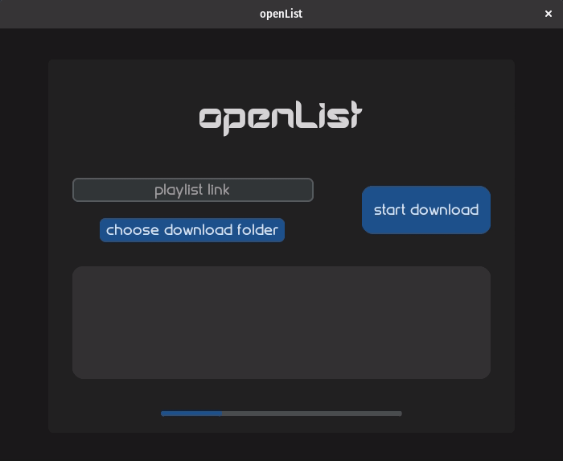
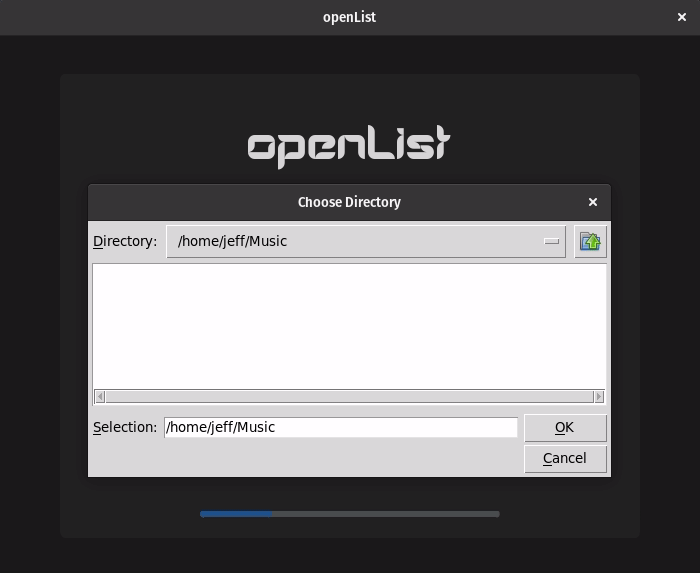
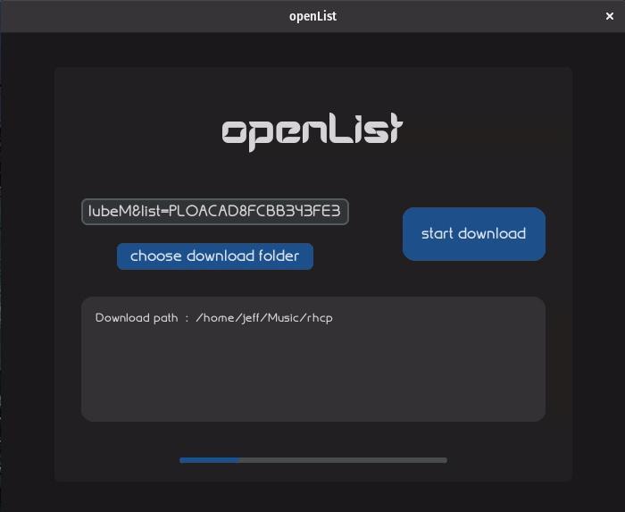
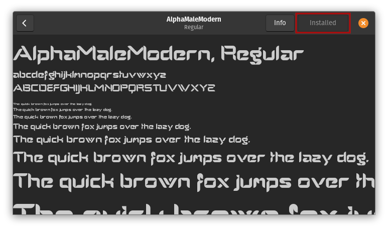
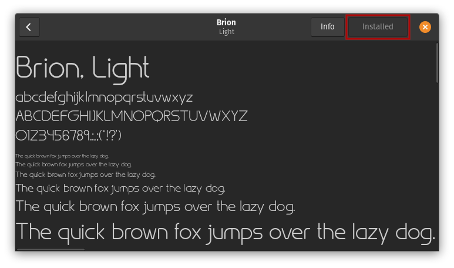
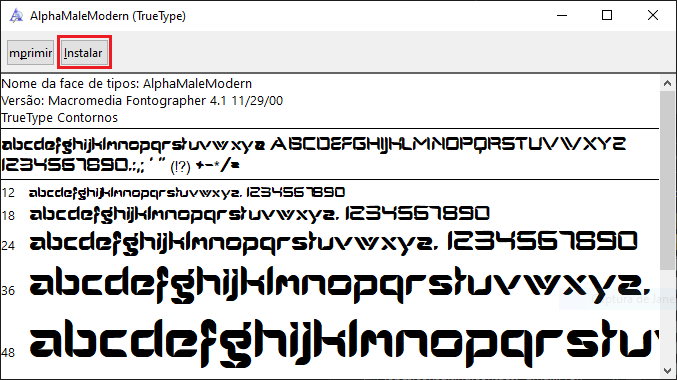
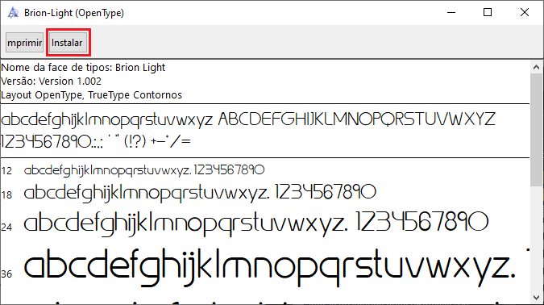

# openList

**openList** is an open music downloader written in python, which downloads and converts YouTube Playlist videos to MP3 audio files.

<div align="left">
    
</div>
<br>

# How to use

## 1 - Get link

Copy the link from the homepage of a YouTube Playlist or from one of their videos and paste it on the 'playlist link' label on the app

<div align="left">
    
</div>
<br>

## 2 - Choose path

Choose the download location where the playlist will be downloaded

<div align="left">
    
</div>
<br>

## 3 - Start downloading

Then just click the start button and follow the updates in the text box to see exactly what openList is doing at the moment

<div align="left">
    
</div>
<br>

# Run as Executable

:TODO:

<br>

# Install instructions

## Linux

Run the following command in the project directory to install the dependencies:

    pip install -r requirements.txt

and install the fonts by clicking in the .ttf files

<div>
    
    
</div>

It is now ready to run with:

    python3 openList.py

<br>

## Windows 

### - Run with python

Run the following command in the project directory to install the dependencies:

    pip install -r requirements.txt

and install the fonts by clicking in the .ttf files

<div>
    
    
</div>

It is now ready to run with:

    python openList.py

### - Packaging

To build the executable,  you cannot use the ```--onefile``` option of pyinstaller, because the customtkinter library includes not only .py files, but also data files like .json and .otf. PyInstaller is not able to pack them into a single .exe file, so you have to use the ```--onedir``` option. 

Include the customtkinter directory manually with the ```--add-data``` option of pyinstaller. You can find the install location of the customtkinter library with the following command:

    pip show customtkinter

A location will be shown, for example: ```c:\users\<user_name>\appdata\local\programs\python\python310\lib\site-packages```

Then add the library folder like this: 

```bash
--add-data "C:/Users/<user_name>/AppData/Local/Programs/Python/Python310/Lib/site-packages/customtkinter;customtkinter/"
```

Additionally, add the resources directory and README file to the build folder by including this command:

```bash
--add-data "resources/*;resources/" --add-data "README.md;."
```

Ensure ***pyinstaller** is set up and built by using the full command like this:

```bash
pyinstaller --noconfirm --onedir --windowed --add-data "C:/users/<user>/appdata/local/programs/python/python310/lib/site-packages/customtkinter;customtkinter/" --add-data "resources/*;resources/" --add-data "README.md;." ".\openList.py"
```