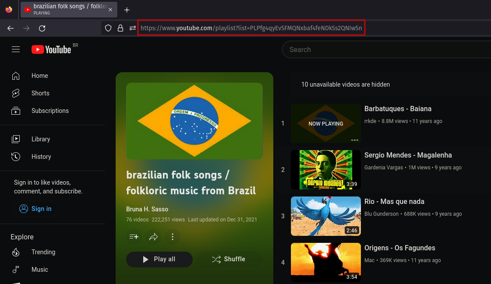

# openList

**openList** is an open music downloader written in python, which downloads and converts YouTube Playlist videos to MP3 audio files.

    

 

## How to use

### 1 - Get link

Copy the link from the homepage of a YouTube Playlist or from one of their videos and paste it on the 'playlist link' label on the app

    

 

### 2 - Choose path

Choose the download location where the playlist will be downloaded

    

 

### 3 - Start downloading

Then just click the start button and follow the updates in the text box to see exactly what openList is doing at the moment

    

 

## Run as Executable

:TODO:

## Install instructions

### Linux

Run the following command in the project directory to install the dependencies:

    pip install -r requirements.txt

and install the fonts by clicking in the .ttf files

    
    

It is now ready to run with:

    python3 openList.py

### Windows 

Run the following command in the project directory to install the dependencies:

    pip install -r requirements.txt

and install the fonts by clicking in the .ttf files

    
    

It is now ready to run with:

    python openList.py